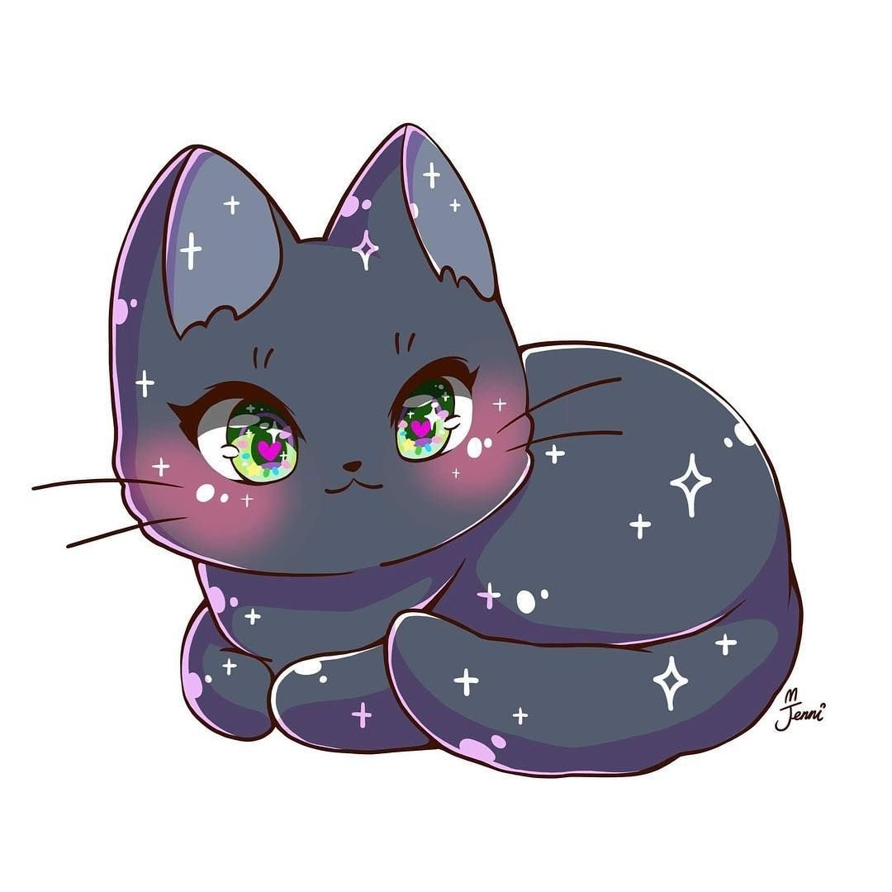

## Основы создания ссылок

[Текст ссылки](https://stepik.org/lesson/1263070/step/1?unit=1277202)

## Альтернативный способ указания ссылки

[Текст ссылки][1]

какой-то текст

[1]: https://stepik.org/lesson/1263070/step/1?unit=1277202

## Автоматические ссылки

<https://stepik.org/lesson/1263070/step/1?unit=1277202>

## Относительные ссылки

[Котейка](07-cat.jpg)

[Котейка 2](07-cat.jpg)

## Основы вставки изображения

## Размеры изображения

